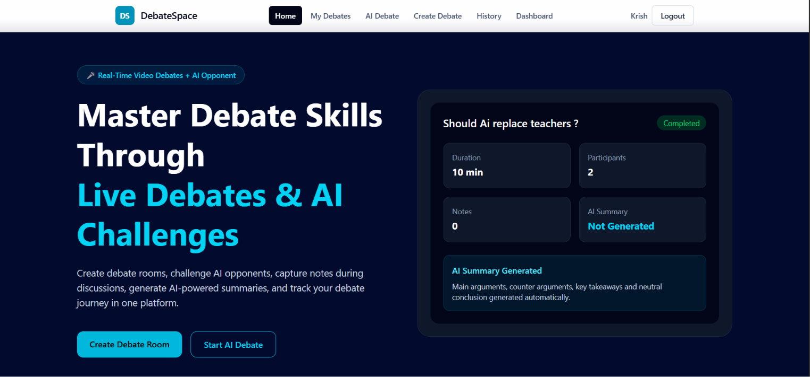
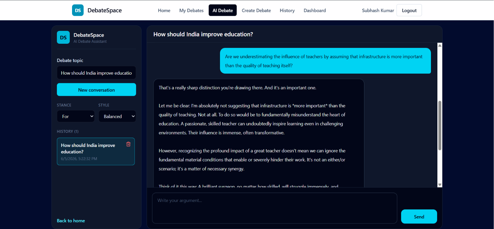
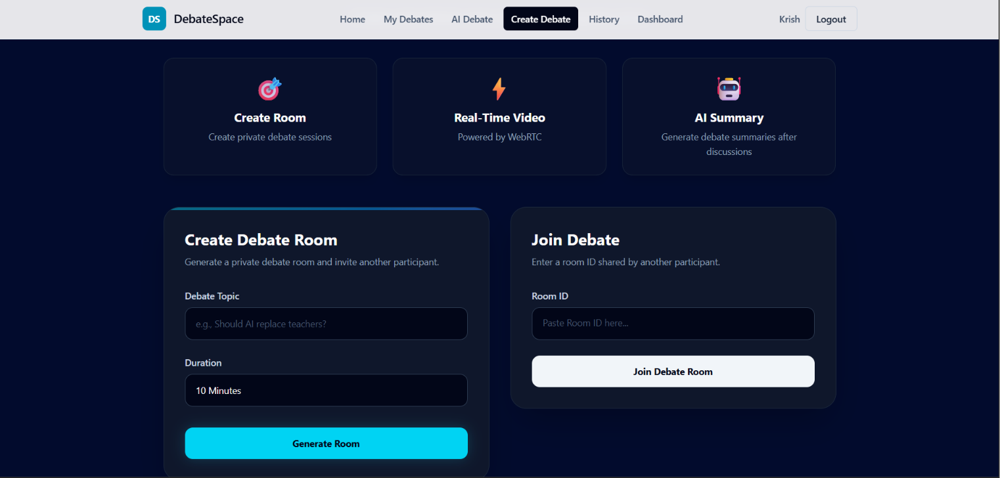
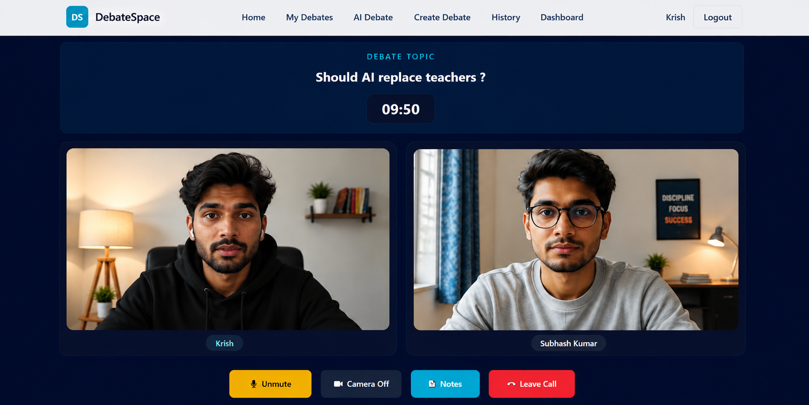
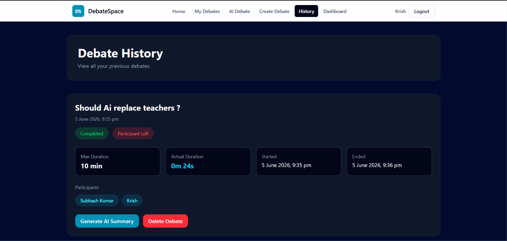
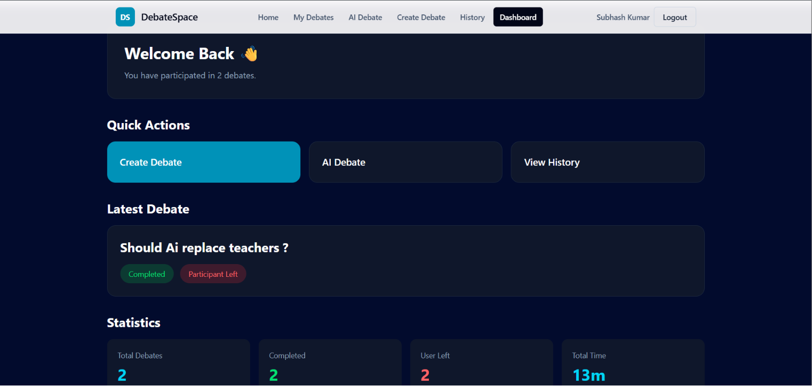

# DebateSpace AI

DebateSpace AI is a full-stack web application built to help users improve their communication, critical thinking, and debating skills through both real-time video debates and AI-powered practice.

Users can challenge other people in live debate rooms or practice with an AI opponent powered by Google Gemini. The platform also provides note-taking, debate history tracking, and a personal dashboard to help users monitor their progress over time.

---

## 🚀 Live Demo

[DebateSpace AI](https://debatespace-ai.vercel.app/)

---

## Screenshots

### Home Page



### AI Debate



### Create Debate



### Video Debate



### Debate History



### Dashboard



---

## Features

### 🎥 Real-Time Video Debates

* Create private debate rooms and invite others to join
* Enter debates using a unique Room ID
* Communicate face-to-face using WebRTC video calling
* Stay synchronized in real time with Socket.IO
* Built-in debate timer for structured discussions
* Automatic debate completion and room handling

### 🤖 AI Debate Opponent

* Practice debating against an AI powered by Google Gemini
* Create and manage multiple AI debate conversations
* Continue previous conversations anytime
* Explore different debate topics and viewpoints
* Delete conversations when no longer needed

### 📝 Debate Notes

* Take notes while debating
* Save important arguments, ideas, and rebuttals
* Quickly access notes during discussions

### 📚 Debate History

* Keep track of completed debates
* View participants and debate details
* Review previous debate activity
* Remove old history entries

### 📊 Dashboard

* View total debates participated in
* Track completed debates
* Monitor total debate time
* See recent activity at a glance

### 🔐 Authentication

* User registration and login
* Secure JWT-based authentication
* Protected routes and user-specific data

---

## Tech Stack

### Frontend

* React
* React Router
* Tailwind CSS
* Axios
* Socket.IO Client

### Backend

* Node.js
* Express.js
* MongoDB
* Mongoose
* Redis
* JWT Authentication
* Socket.IO

### Real-Time Communication

* WebRTC
* Socket.IO

### AI

* Google Gemini API

---

## Architecture

```text
Frontend (React)
       │
       ▼
Express Backend
       │
 ┌─────┴─────┐
 ▼           ▼
MongoDB    Redis
       │
       ▼
Socket.IO
       │
       ▼
WebRTC
       │
       ▼
Gemini AI
```

---

## Project Structure

```text
debatespace-ai
│
├── client
│   ├── public
│   ├── src
│   │   ├── api
│   │   ├── assets
│   │   ├── components
│   │   ├── pages
│   │   ├── store
│   │   └── utils
│
├── server
│   ├── config
│   ├── controllers
│   ├── middleware
│   ├── models
│   ├── routes
│   ├── services
│   └── sockets
│
└── README.md
```

---

## Installation

### Clone the Repository

```bash
git clone https://github.com/SubhashSonu/debatespace-ai.git
cd debatespace-ai
```

### Install Frontend Dependencies

```bash
cd client
npm install
```

### Install Backend Dependencies

```bash
cd ../server
npm install
```

---

## Environment Variables

### Server (.env)

```env
PORT=5000

MONGO_URI=your_mongodb_connection_string

REDIS_URL=your_redis_connection_string

JWT_SECRET=your_jwt_secret

GEMINI_API_KEY=your_gemini_api_key

CLIENT_URL=http://localhost:5173
```

### Client (.env)

```env
VITE_API_URL=http://localhost:5000/api

VITE_SOCKET_URL=http://localhost:5000
```

---

## Running the Application

### Start the Backend Server

```bash
cd server
npm run dev
```

### Start the Frontend

```bash
cd client
npm run dev
```

The application will be available at:

```text
http://localhost:5173
```

---

## Application Flow

### Video Debate

```text
Create Room
    ↓
Share Room ID
    ↓
Opponent Joins
    ↓
WebRTC Connection Established
    ↓
Live Debate
    ↓
Debate Ends
    ↓
History Saved
```

### AI Debate

```text
Create Conversation
    ↓
Choose a Topic
    ↓
Send an Argument
    ↓
Gemini Generates a Counter Argument
    ↓
Conversation Saved
```

---

## Skills Demonstrated

This project highlights experience with:

* Full-Stack MERN Development
* REST API Design and Development
* JWT Authentication and Authorization
* MongoDB Data Modeling
* Redis Integration and Caching
* Socket.IO Integration
* WebRTC Video Communication
* Real-Time Application Development
* AI Integration with Google Gemini
* State Management
* Frontend and Backend Architecture
* Cloud Deployment

---

## Future Improvements

* Password Reset
* AI Debate Judge
* AI Debate Scoring
* Whiteboard Collaboration
* Spectator Mode
* User Profiles
* Debate Analytics
* Debate Rankings

---

## Author

**Subh**

Built to help people become better communicators, thinkers, and debaters through both human-to-human discussions and AI-powered practice.

---

⭐ If you found this project interesting, consider giving it a star.
